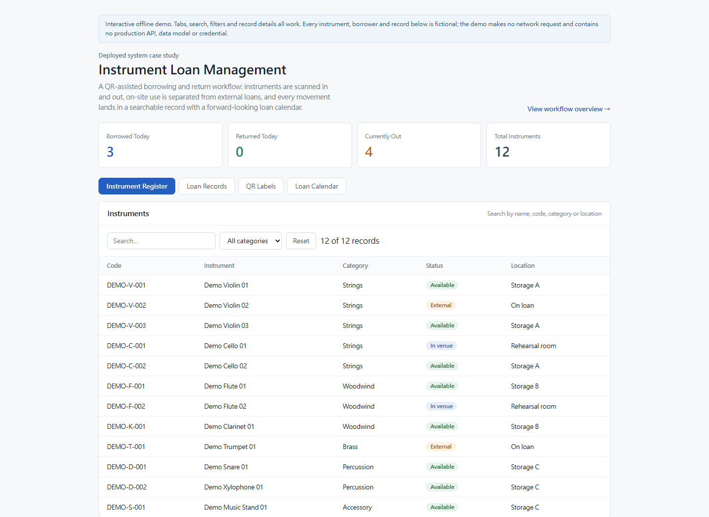
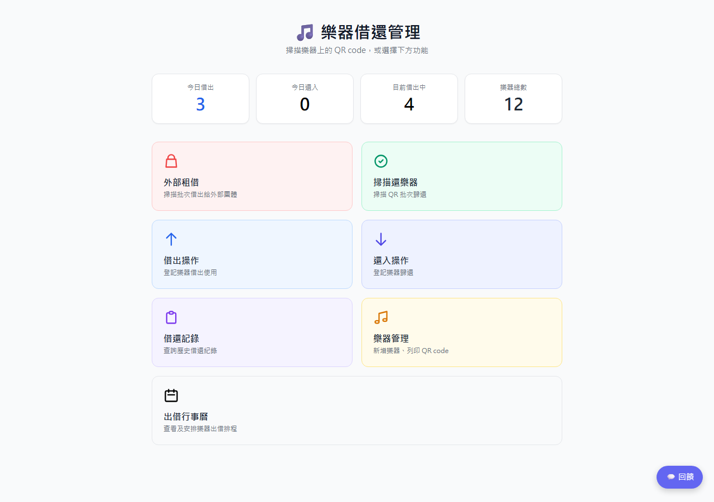
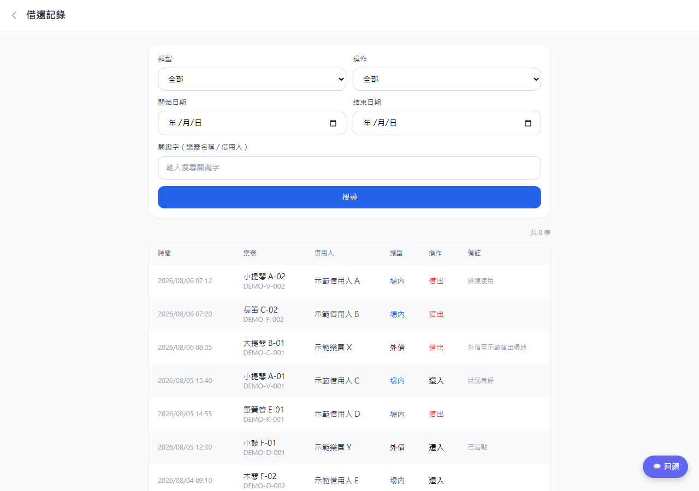
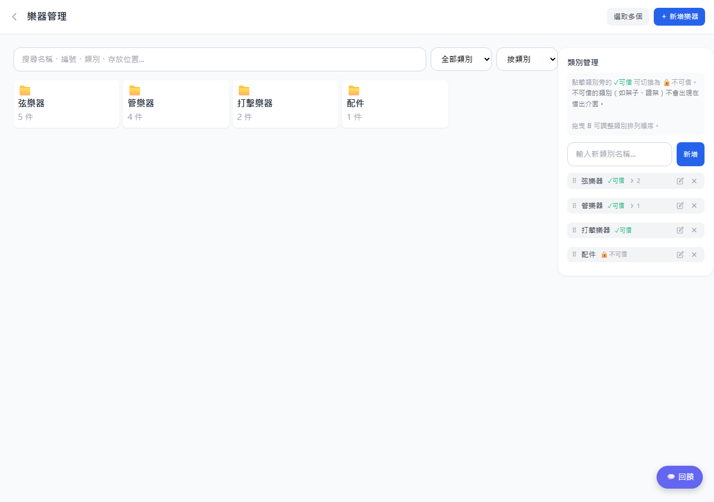

# Instrument Loan Management - Case Study

## Anonymized Screens from the Deployed System

The images below are the deployed system's own interface (Traditional Chinese), rendered offline with every production endpoint removed and fictional instruments, borrowers and records injected in place of real data.

| Home | Loan records | Instrument administration |
|------|--------------|---------------------------|
|  |  |  |

## Status

Deployed for operational use. The complete source code and service configuration are private.

## Product Scope

- QR-assisted instrument identification
- Individual and batch borrowing workflows
- On-site use and external loans
- Return processing and condition tracking
- Instrument directory and printable labels
- Loan history and schedule review

## Technical Summary

The system was designed as a lightweight responsive web application with structured API access, role-aware administrative workflows, and mobile-friendly scanning flows.

## Public Demo

Open `demo.html` for the interactive English demo: an instrument register, borrow and return history, printable QR labels, and a loan calendar, each with working search, filters and record details. `index.html` is a shorter workflow overview. Both use fictional data and make no network requests.

## Disclosure Boundary

Production APIs, data models, identifiers, credentials, records, and business-specific implementation are not included.

